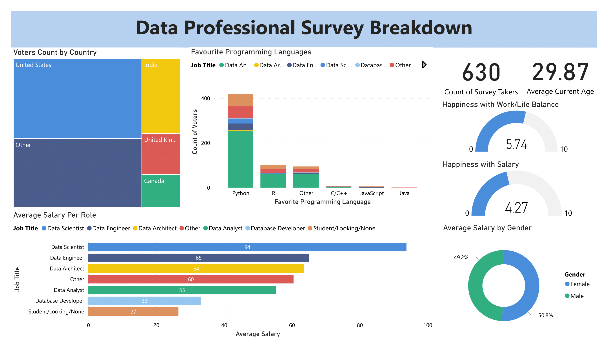

# 📊 Data Professional Survey Dashboard

## 🔍 Overview
This Power BI dashboard visualizes insights from a survey conducted among data professionals, showcasing key metrics such as salary distribution, favorite programming languages, happiness levels, and demographic breakdowns.

## 📌 Features
- **Voter Distribution by Country**: A treemap visualization of survey respondents by country.
- **Favorite Programming Languages**: A stacked bar chart showing the most preferred programming languages across different job roles.
- **Salary Analysis**:
  - **By Role**: Average salaries for Data Scientists, Data Engineers, Data Analysts, and other roles.
  - **By Gender**: A pie chart representing salary distribution between male and female professionals.
- **Happiness Metrics**:
  - Work-life balance satisfaction score.
  - Salary satisfaction score.
- **Demographics**:
  - Number of survey respondents.
  - Average age of participants.

## 📊 Tools & Technologies
- **Power BI**: Data visualization and interactive reporting.
- **Survey Dataset**: (Provide source or description if applicable).
- **Data Cleaning & Transformation**: Power Query for ETL (Extract, Transform, Load).

## 📷 Dashboard Preview

## 🚀 How to Use
1. Download the Power BI file (`.pbix`) from this repository.
2. Open the file in [Power BI Desktop](https://powerbi.microsoft.com/desktop/).
3. Explore the interactive charts and insights.

## 📈 Future Enhancements
- Add more filtering options for deeper analysis.
- Integrate real-time data updates.
- Improve visual design for better user experience.

## 🤝 Contributing
Feel free to contribute by submitting issues or pull requests!

## Author
[**Aaryen DSouza**](https://github.com/aaryen-dsouza) - Passionate about data visualization, analytics, and actionable insights.